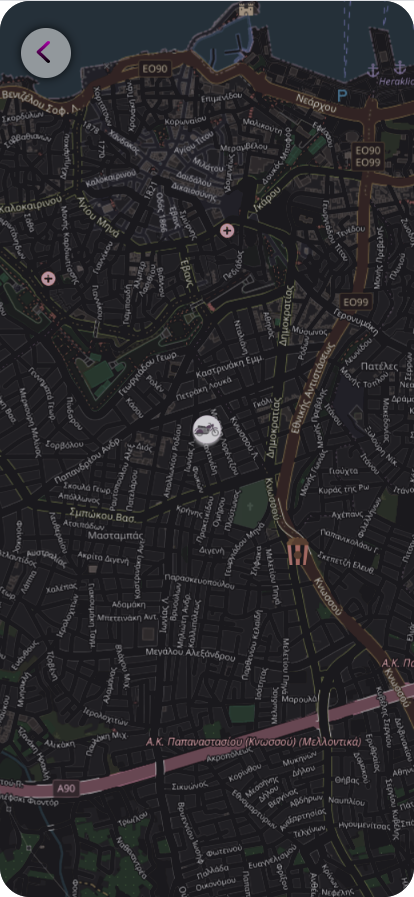

# Smart Helmet Application


Mobile-AR integration for smart helmets, enhancing safety and functionality with real-time data overlays. 

## Overview

Our innovative postgraduate project, developed during the HY569 course, introduces the Smart Helmet, aimed at enhancing safety and functionality through real-time data overlays. This project combines web application technology with AR (Augmented Reality) capabilities. The Smart Helmet assumes the role of AR glasses, allowing users to make decisions directly from their mobile devices. Tested and refined during the course, this solution offers intuitive interfaces for efficient safety management and heightened productivity.

Our application comprises two distinct components: the web interface and the AR functionality. My focus was primarily on the web portion of the project. Leveraging the OpenStreetMap API, we obtained comprehensive mapping capabilities and access to diverse geographic data. Additionally, we integrated APIs for real-time user location tracking and live weather updates.  

## Key Features
* **Real-Time Navigation**: Navigate with ease using a map display that provides live updates of your surroundings, ensuring efficient travel from point A to point B.
* **Weather Updates**: Stay informed about current weather conditions along your route, allowing for better planning and preparation.
* **Speed Tracking**: Monitor your speed in real-time, promoting safe and responsible driving practices.
* **Location Saving**: Save important locations for quick access and seamless navigation to frequently visited destinations.
* **Integration of External Sensors**: Utilize external sensors like alcohol detectors to enhance safety while driving, providing alerts and ensuring responsible behavior.
* **Post-Trip Analysis**: Review detailed insights and analysis of your journey after reaching your destination, facilitating continuous improvement in driving habits and decision-making.

## Screenshots

|  |  |  |
|:---:|:---:|:---:|
| Initialize the app | Search | Maps | 

|  |  |  
|:---:|:---:|:---:|
| Saved Location | New Location | Type of Location | 

## Installation 

What you will need:
* NodeJS
* Angular
* MongoDB

Tested on: 
* NodeJS v18.12.1
* Angular v14.2.8
* MongoDB v4.4

### Useful commands
Before running the application and after every new node_module is installed using `npm install @package-name`, all project members must execute in both *`backend`* and *`frontend`*:
```sh
npm install
``` 

For frontend, inside *`frontend`* folder:

> Run frontend:
```sh
ng serve
```

> Run frontend (open access from other devices using server's IP):
```sh
ng serve --host 0.0.0.0
```

For backend, inside *`backend`* folder:
> Run backend:
```sh
npm run dev
```

**Do not forget**: mongod.exe (if on Windows) must be running for the Database to be used. 

## Evaluation
The heuristic evaluation of the application design was done in the context of the HY569 course by various users who, after our guidance, provided their conclusions.
